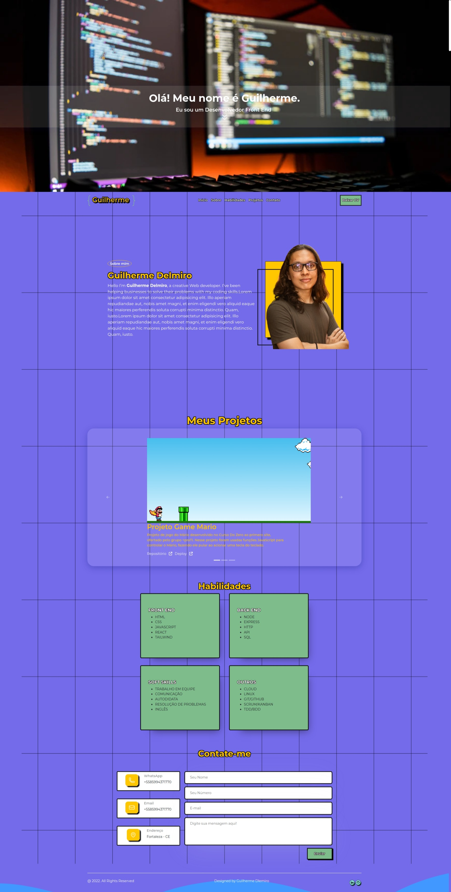

<p align="center">
  
</p>

<h1 align="center"> ⭐ Portfólio </h1>


[](#table-of-contents)

<p align="center">
  <a href="#Introdução"> 🧩 Introdução </a>&nbsp;&nbsp;&nbsp;|&nbsp;&nbsp;&nbsp;
  <a href="#Resultados"> 🚀 Resultados</a>&nbsp;&nbsp;&nbsp;|&nbsp;&nbsp;&nbsp;
  <a href="#Dependências"> 🧪 Dependências</a>&nbsp;&nbsp;&nbsp;|&nbsp;&nbsp;&nbsp;
  <a href="#Ideias">💡 Possíveis Melhorias </a>&nbsp;&nbsp;&nbsp;|&nbsp;&nbsp;&nbsp;
</p>

<br/>

<a id="Introdução"></a>

## 🧩 Introdução

**_⠀⠀⠀⠀⭐ Projeto final do curso de Front end do Happy Code, consiste em um Portfólio criado por mim mesmo, além do design no Figma_**

<br/>

<a id="Resultados"></a>

## 🚀 Resultados

> Todos os resultados foram alcançados com sucesso. De modo geral são esses os resultados de cada requisição.

<br/>

## Front-end

</summary>


### 💻 Desktop

| ⭐ Página Incial                                                                                                           | \                                                                                                         | \ 
|------------------------------------------------------------------------------------------------------------------ | ------------------------------------------------------------------------------------------------------------------ | ------------------------------------------------------------------------------------------------------------------ |
| 

<br/>

<a id="Dependências"></a>

## 🧪 Dependências

> Requisitos para rotar o codigo...

<br />

## `📖 Scripts`

```JSON
  "scripts": {
    "dev": "vite",
    "build": "vite build",
    "preview": "vite preview"
  }

```

## `📖 Dependencies`

```JSON
  "dependencies": {
        "@popperjs/core": "^2.11.6",
        "bootstrap": "^5.2.3",
        "react": "^18.2.0",
        "react-bootstrap": "^2.7.2",
        "react-dom": "^18.2.0",
        "react-router-dom": "^6.8.1"
      }

```

<br />

## `📖 devDependencies`

```JSON
      "devDependencies": {
        "@fortawesome/fontawesome-svg-core": "^6.3.0",
        "@fortawesome/free-regular-svg-icons": "^6.3.0",
        "@fortawesome/free-solid-svg-icons": "^6.3.0",
        "@fortawesome/react-fontawesome": "^0.2.0",
        "@types/react": "^18.0.28",
        "@types/react-dom": "^18.0.11",
        "@vitejs/plugin-react": "^3.1.0",
        "react-parallax": "^3.5.1",
        "react-scroll": "^1.8.9",
        "typewriter-effect": "^2.19.0",
        "vite": "^4.1.4"
      }

```

<a id="Ideias"></a>

## 💡 Possíveis Melhoras

> Possíveis melhorias no código e no projeto, caso queira voltar e melhorá lo.

<br />

### **_⠀⠀⠀⠀⭐ Área exclusiva para possiveis melhorias ou coisa que seria interessante ter no projeto, mas vai ficar para o futuro._**

<br />

- [ ] **_- Responsividade p/ todos dispositivos._**
- [ ] **_- Animações no fundo._**
- [ ] **_- Criar funcionalides para formulário_**
- [ ] **_- ..._**


<br />

<br />

<div >

<a id="Creditos"></a>
## 🏆 Criador
</br>

| [<br><sub> Guilherme Delmiro </sub>](https://www.linkedin.com/in/guilhermehub12/) |     |
| ----------------------------------------------------------------------------------------------------------------------------------------------------------- | --- |

</div>
